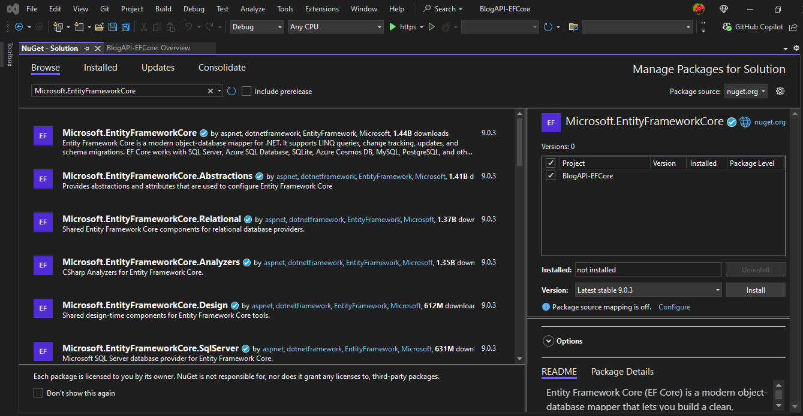
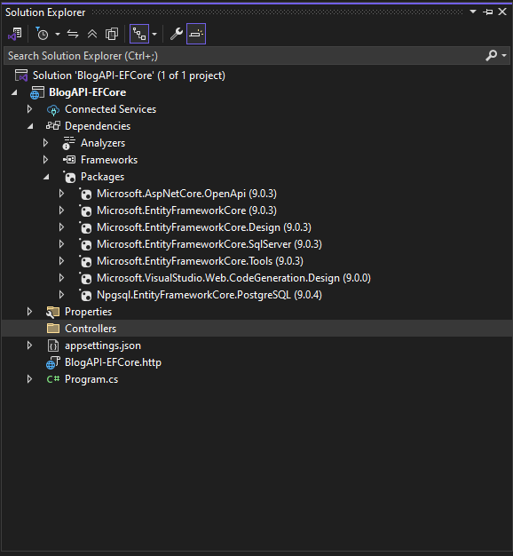
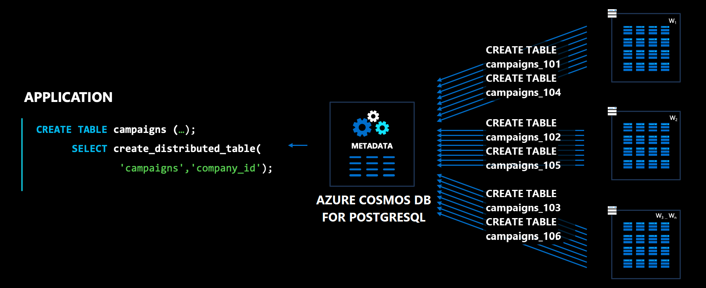
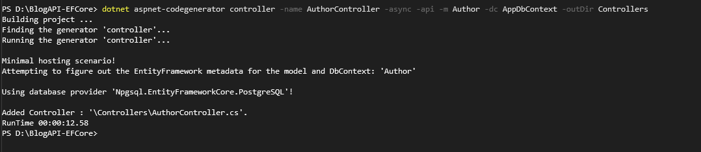

# EF Core: Simplifying Database Interactions in .NET

## Table of Contents

1. [Why EF Core?](#why-ef-core)
2. [What is EF Core?](#what-is-ef-core)
3. [Why Use EF Core?](#why-use-ef-core)
4. [New Features in EF Core (.NET 9)](#new-features-in-ef-core-net-9)
5. [Setting Up EF Core](#setting-up-ef-core)
6. [Defining Models and Relationships](#defining-models-and-relationships)
7. [Data Annotations vs Fluent API](#data-annotations-vs-fluent-api)
8. [Migrations and Database Operations](#migrations-and-database-operations)
9. [Basic CRUD Operations](#basic-crud-operations)
10. [Performance and Best Practices](#performance-and-best-practices)
11. [Handling Concurrency in EF Core](#handling-concurrency-in-ef-core)
12. [Closing](#closing)

---

# Introduction

**Brian Kemboi**

**Microsoft Most Valuable Professional - .NET**

**Co-lead at Kenya Data Platform**


### Social Media

[LinkedIn](https://www.linkedin.com/in/kibichii-brian/)

[X](https://x.com/kibichii_brian)

[Website](https://www.briankemboi.me/)

# Why EF Core?

## Quick Story/Example

Imagine you're building a .NET application and need to interact with a database. How do you do it efficiently? You could write raw SQL queries, but that can be error-prone and hard to maintain. This is where an ORM (Object-Relational Mapper) like EF Core comes in handy.

## How Do We Interact with Databases in .NET?

Before Entity Framework Core (EF Core), developers interacted with databases using **ADO.NET**, **Dapper**, or raw SQL queries. While these approaches provided control and performance, they often required writing a lot of boilerplate code for CRUD operations.

- Open a database connection.
- Write SQL queries manually.
- Handle result mappings to objects.
- Manage transactions and exceptions explicitly

This process is repetitive and error-prone. This is where **EF Core** comes in.

---

# What is EF Core?

EF Core is a modern, open-source, and cross-platform **Object-Relational Mapper (ORM)** for .NET that eliminates the need to write complex SQL queries manually. It allows developers to work with databases using **C# classes and LINQ** instead of SQL.

EF Core acts as a bridge between **.NET applications** and **databases**, allowing developers to perform operations using object-oriented techniques.

---

# Why Use EF Core?

### 🚀 **Simplifies Data Access**

EF Core abstracts database interactions, allowing developers to use **C# objects** instead of SQL queries.

### ⚡ **Boosts Productivity**

- Eliminates the need to write repetitive SQL queries.
- Supports **automatic migrations** to handle database schema changes.
- Works seamlessly with **LINQ queries** for data retrieval.

### 🔄 **Supports Multiple Databases**

EF Core is database-agnostic and supports multiple database providers, including:

- **SQL Server**
- **PostgreSQL**
- **MySQL**
- **SQLite**
- **Azure Cosmos DB**

---

# New Features in EF Core (.NET 9)

## Enhanced Raw SQL Queries

- Enables safer and more efficient execution of raw SQL statements.
- Improves mapping results directly to entity models.

### Example: Executing Raw SQL in EF Core 9

```csharp
var users = await context.Users
    .FromSql($"SELECT * FROM Users WHERE IsActive = 1")
    .ToListAsync();
```

## Better LINQ Translation

- Supports more complex expressions and nested queries.
- Reduces unnecessary SQL statements for better performance.

### Example: Improved LINQ Translation

```csharp
var highValueOrders = await context.Orders
    .Where(o => o.TotalAmount > 100)
    .Select(o => new { o.Id, o.TotalAmount })
    .ToListAsync();
```

---

# Setting Up EF Core

## Installing EF Core

To install EF Core in your .NET project, run the following command in your terminal:
In visual studio code

```bash
dotnet add package Microsoft.EntityFrameworkCore
```

In Visual Studio, click on Tools-Nuget Package Manager and search - **Microsoft.EntityFrameworkCore** and install

<!-- add an image -->



---

## List of Other Packages We Need to Scaffold

1. **Microsoft.EntityFrameworkCore.Design**

   - Provides design-time tools for EF Core, such as scaffolding and migrations.
   - Required for generating models from an existing database.
2. **Microsoft.EntityFrameworkCore.SqlServer**

   - Adds support for SQL Server as a database provider.
   - Essential for applications using SQL Server as the backend.
3. **Microsoft.EntityFrameworkCore.Tools**

   - Provides command-line tools for EF Core, such as `dotnet ef` commands.
   - Used for managing migrations and database updates.
4. **Microsoft.VisualStudio.Web.CodeGeneration.Design**

   - Enables scaffolding of controllers, views, and other components in ASP.NET Core projects.
   - Useful for quickly generating boilerplate code.
5. **Npgsql.EntityFrameworkCore.PostgreSQL**

   - Adds support for PostgreSQL as a database provider.
   - Required for applications using PostgreSQL or Azure Cosmos DB for PostgreSQL.



---

# Defining Models and Relationships

## Simple Model Example: Author and Blog

We will create a simple blog management system to practice skills on EF Core.

### Example:  Author and Blog

1. Create **Models** Folder
2. Add **Author.cs** and **Blog.cs**

# Data Annotations vs Fluent API

## Data Annotations

- [Required]: Ensures the property is not null.
- [MaxLength]: Sets the maximum length of a string property.
- [Key]: Marks a property as the primary key.

### Author Entity

```csharp

public class Author
{
    [Key]
    public int Id { get; set; }
    [Required]
    [StringLength(50)]
    public string Name { get; set; }
    [Required]
    [EmailAddress]
    public string Email { get; set; }
}

```

### Blog Entity

```csharp
    public class Blog
    {
        [Key]
        public int Id { get; set; }
        [Required]
        [StringLength(200)]
        public string Title { get; set; }
        [Required]
        public string Content { get; set; }
        public string[] Tags { get; set; }

        //Reference to Author
        public int AuthorId { get; set; }
        public Author Author { get; set; }

    }
```

---

# Azure Cosmos DB

## What is Azure Cosmos DB?

Azure Cosmos DB is Microsoft's globally distributed, multi-model database service designed for modern app development. It offers:

- **Turnkey global distribution**: Data automatically replicated across Azure regions
- **Multi-model support**: Key-value, document, graph, and column-family data models
- **Guaranteed low latency**: Single-digit millisecond response times at the 99th percentile
- **Elastic scalability**: Instantaneous scaling of throughput and storage worldwide

## Key Features

✔ **Five consistency levels** from strong to eventual
✔ **SLA-backed** 99.999% availability
✔ **Serverless option** for sporadic workloads
✔ **Analytical store** for big data analytics

---

# Azure Cosmos DB for PostgreSQL

## The Best of Both Worlds

Azure Cosmos DB for PostgreSQL combines:

1. **PostgreSQL's** full SQL compatibility and rich extensions
2. **Cosmos DB's** horizontal scaling and global distribution

## How It Works

- **Distributed PostgreSQL** as a managed service
- **Citus extension** built-in for sharding
- **Fully compatible** with PostgreSQL tools and drivers
- **Auto-sharding** with simple function calls (`create_distributed_table()`)

### Example Use Cases:

- Multi-tenant SaaS applications
- Real-time analytics dashboards
- High-throughput transactional systems
- Time-series data processing

---

# Concepts of Sharding and The Benefits



## What is Sharding?

Sharding is a database architecture pattern that:

- **Horizontally partitions** data across multiple machines
- **Distributes load** to avoid single-server bottlenecks
- **Enables linear scaling** by adding more nodes

# Understanding Database Sharding

## What is Sharding?

**Sharding** is a horizontal partitioning technique that splits a database into smaller, faster, more manageable pieces called **shards**. Each shard:

- Contains a subset of the total data
- Runs on separate database nodes
- Can be physically located in different regions

### Analogy: Library Organization

Imagine a library (database) growing too large for one building:

- **Vertical Scaling**: Add more floors (bigger server)
- **Sharding**: Build branch libraries (shards) where:
  - Each branch contains books for certain letters (partition key)
  - Patrons go directly to the relevant branch

## How Sharding Works (Deep Dive)

### 1. Partition Key Selection

Choose a column that determines how data is distributed:

```sql
-- Example: Distributing user data by country code
SELECT create_distributed_table('users', 'country_code');
```

### Before Sharding

Single Database:

- 10M customers
- 100M orders
- Frequent timeouts during sales

### After Sharding by Customer Region

Shard 1 (NA):

- 4M customers
- 40M orders

Shard 2 (EU):

- 3M customers
- 30M orders

Shard 3 (APAC):

- 3M customers
- 30M orders

## How Sharding Works in Cosmos DB for PostgreSQL

1. **Choose a distribution column** (shard key) like `tenant_id` or `user_id`
2. **Data is partitioned** using consistent hashing
3. **Queries are routed** to relevant shards automatically

```sql
-- Make a table distributed
SELECT create_distributed_table('orders', 'customer_id');

# Adding Connection string
We shall be connecting to azure cosmosDB for postgres

```json
  "ConnectionStrings": {
    "CosmosPostgres": "Server=c-dotnetprostgres.p4uyheg6kn4ww2.postgres.cosmos.azure.com;Database=citus;Port=5432;User Id=citus;Password=dotnetConf@2025;Ssl Mode=Require;"
  }

```

# Migrations and Database Operations

## EF Core Migrations

Migrations are a way to apply changes to the database schema based on your model classes.

Create **AppDbContext.cs** in the Models Folder

```csharp
public class AppDbContext: DbContext
{
    public AppDbContext(DbContextOptions<AppDbContext> options) : base(options)
    {
    }
    public DbSet<Author> Authors { get; set; }
    public DbSet<Blog> Blogs { get; set; }

    protected override void OnModelCreating(ModelBuilder modelBuilder)
    {
        base.OnModelCreating(modelBuilder);
        modelBuilder.Entity<Blog>()
            .ToTable("blogs")
            .HasKey(e => e.Id);
    }

    public async Task DistributeTableAsync()
    {
        await Database.ExecuteSqlRawAsync("SELECT create_distributed_table('Blogs', 'id')");
    }
}

```

Register the DbContext in Program.cs

```csharp
builder.Services.AddDbContext<AppDbContext>(options =>
    options.UseNpgsql(builder.Configuration.GetConnectionString("CosmosPostgres")));

```

# Scaffolding

- Create Controllers for Blog

```bash
dotnet aspnet-codegenerator controller -name AuthorController -async -api -m Author -dc AppDbContext -outDir Controllers 
```

- Create Controllers for Author

```bash
dotnet aspnet-codegenerator controller -name BlogController -async -api -m Blog -dc AppDbContext -outDir Controllers 
```



### Adding a Migration

In Visual Studio Code

```bash
dotnet ef migrations add InitialCreate
```

In Visual Studio

```bash
Add-Migration InitialCreate
```

### Applying Migrations to the Database

In Visual Studio Code

```bash
dotnet ef database update
```

In Visual Studio

```bash
Update-Database
```

---

# Basic CRUD Operations - Demo

- Add BlogDTO
  Create **BlogDTO.cs** in Resources folder

```csharp
    public class BlogDTO
    {
        public int Id { get; set; }
        public string Title { get; set; }
        public string Content { get; set; }
        public string[] Tags { get; set; }
        public int AuthorId { get; set; }
        public AuthorDTO? Author { get; set; }
    }

    public class AuthorDTO
    {
        public int Id { get; set; }
        public string Name { get; set; }
        public string Email { get; set; }
    }

```

## Update the Blog Controller to use the BlogDTO

- GET: api/Blog

```csharp

[HttpGet]
public async Task<ActionResult<IEnumerable<BlogDTO>>> GetBlogs()
{
    var blogs = await _context.Blogs.Include(b => b.Author).ToListAsync();
    var blogDTOs = blogs.Select(b => new BlogDTO
    {
        Id = b.Id,
        Title = b.Title,
        Content = b.Content,
        Tags = b.Tags,
        AuthorId = b.AuthorId,
        Author = new AuthorDTO
        {
            Id = b.Author.Id,
            Name = b.Author.Name,
            Email = b.Author.Email
        }
    }).ToList();

    return blogDTOs;
}

```

- GET: api/Blog/5

```csharp

        [HttpGet("{id}")]
        public async Task<ActionResult<BlogDTO>> GetBlog(int id)
        {
            var blog = await _context.Blogs.Include(b => b.Author).FirstOrDefaultAsync(b => b.Id == id);

            if (blog == null)
            {
                return NotFound();
            }

            var blogDTO = new BlogDTO
            {
                Id = blog.Id,
                Title = blog.Title,
                Content = blog.Content,
                Tags = blog.Tags,
                AuthorId = blog.AuthorId,
                Author = new AuthorDTO
                {
                    Id = blog.Author.Id,
                    Name = blog.Author.Name,
                    Email = blog.Author.Email
                }
            };

            return blogDTO;
        }

```

- POST: api/Blog

```csharp

 [HttpPost]
 public async Task<ActionResult<BlogDTO>> PostBlog(BlogDTO blogDTO)
 {
     var blog = new Blog
     {
         Title = blogDTO.Title,
         Content = blogDTO.Content,
         Tags = blogDTO.Tags,
         AuthorId = blogDTO.AuthorId
     };

     _context.Blogs.Add(blog);
     await _context.SaveChangesAsync();

     blogDTO.Id = blog.Id;

     return CreatedAtAction("GetBlog", new { id = blog.Id }, blogDTO);
 }

```

- PUT: api/Blog/5

```csharp

        [HttpPut("{id}")]
        public async Task<IActionResult> PutBlog(int id, BlogDTO blogDTO)
        {
            if (id != blogDTO.Id)
            {
                return BadRequest();
            }

            var blog = await _context.Blogs.FindAsync(id);
            if (blog == null)
            {
                return NotFound();
            }

            blog.Title = blogDTO.Title;
            blog.Content = blogDTO.Content;
            blog.Tags = blogDTO.Tags;
            blog.AuthorId = blogDTO.AuthorId;

            _context.Entry(blog).State = EntityState.Modified;

            try
            {
                await _context.SaveChangesAsync();
            }
            catch (DbUpdateConcurrencyException)
            {
                if (!BlogExists(id))
                {
                    return NotFound();
                }
                else
                {
                    throw;
                }
            }

            return NoContent();
        }

```

- DELETE: api/Blog/5

```csharp

[HttpDelete("{id}")]
public async Task<IActionResult> DeleteBlog(int id)
{
    var blog = await _context.Blogs.FindAsync(id);
    if (blog == null)
    {
        return NotFound();
    }

    _context.Blogs.Remove(blog);
    await _context.SaveChangesAsync();

    return NoContent();
}

private bool BlogExists(int id)
{
    return _context.Blogs.Any(e => e.Id == id);
}

```

# Performance and Best Practices

## Optimizing Queries with Projections

Query the data you need.

```csharp
var userNames = await context.Users
    .Where(u => u.IsActive)
    .Select(u => new { u.Name })
    .ToListAsync();
```

---

# Closing

## Recap Key Takeaways

- EF Core simplifies database interactions in .NET applications.
- New features in EF Core 9 improve performance, raw SQL execution, and LINQ translation.
- You can easily define models, relationships, and apply migrations.
- CRUD operations are straightforward with async support.
- Concurrency handling in EF Core helps prevent conflicts in multi-user scenarios.

## Useful Resources

- **Microsoft Docs**:[EF Core Documentation](https://docs.microsoft.com/en-us/ef/core/)[Getting Started with EF Core](https://docs.microsoft.com/en-us/ef/core/get-started/)
- **Code GitHub Repository**:
  [EF Core GitHub](https://github.com/dotnet/efcore)

## Q&A

Feel free to ask any questions about EF Core, .NET, or anything covered in today’s talk!
